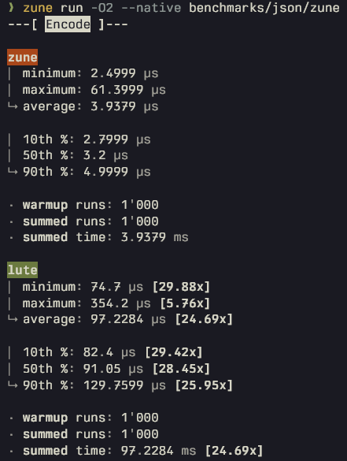

<div align="center">
  <strong>benchmarks</strong>

  Collection of Luau benchmarks
</div>



## 🔨 Usage

Benchmarks are organized in folders under `benchmarks/`.<br>
Each folder is named after the benchmark, and can contain entrypoints for different runtimes (if applicable) and / or helper modules.<br>
Generators for passing random data into benchmarks are organized under `generators/`.

Before defining a benchmark, you must first import the runner from `@lib/runner`.<br>
Afterwards:
```luau
runner {
    -- Title of the benchmark.
    title = "Math",
    -- A collection of benchmark functions alongside their names.
    benchmarks = {
        ["vm"] = function(input)
            return (math.sqrt(input.a * input.b - input.c + input.a // input.b) * math.cos(input.b)) % math.sin(input.c)
        end,
        ["codegen"] = @native function(input)
            return (math.sqrt(input.a * input.b - input.c + input.a // input.b) * math.cos(input.b)) % math.sin(input.c)
        end,
    },
    -- Generates some random input for each run.
    -- Optional. Not counted towards final time.
    generator = function()
        return {
            a = math.random(-50, 50),
            b = math.random(1, 90),
            c = math.random(1, 90),
        }
    end,
    -- Validates the output of each benchmark function for each run.
    -- Optional. Not counted towards final time.
    validator = function(input, output)
        return mod(mul(sqrt(add(sub(mul(input.a, input.b), input.c), floordiv(input.a, input.b))), cos(input.b)), sin(input.c)) == output
    end,
    -- Amount of runs to perform.
    runs = 500_000_000,
    -- Amount of warmup runs to perform prior to actual runs.
    -- Optional. Not ocunted towards final time nor run count.
    warmup_runs = 100_000,
}
```
You may have as many runners in a benchmark as needed.<br>
It's recommended to have one benchmark for each thing you want to test, as it allows to pass in a matching generator and validator.<br>
For example, given a module like:
```luau
local function add(a: number, b: number): number
    return a + b
end

local function sub(a: number, b: number): number
    return a - b
end

return {
    add = add,
    sub = sub,
}
```
You'd have a separate runner (and so benchmark) for `add` and `sub`.

## 🏗️ Running

In order to run a benchmark, simply execute the entrypoint for the given runtime with it:
```sh
zune run benchmarks/json/zune
lute run benchmarks/json/lute
# And so on...
```

For benchmarking across different runtimes, keep in mind that some runtimes might not have the same capabilities as others.<div>
For example, [lute](https://github.com/luau-lang/lute) as of the time of writing doesn't currently support native codegen. To not artificially inflate the results of your benchmarks, you'd need to reflect that amongst other runtimes.<div>
For the default included ones you'd be able to do that with:
```sh
zune run --no-jit my_benchmark # NCG & O2 are enabled by default
LUNE_LUAU_JIT=off lune run my_benchmark # NCG & O2 are enabled by default
```

## 📁 Benchmarks

This repository currently includes the following benchmarks:
- [json](/benchmarks/json)
  - A benchmark of JSON implementations across different runtimes.
  - Each runtime entrypoint benchmarks lute's pure Luau implementation and its own.
  - JSON implementations are validated by each other.

## ⚖️ License

This project is licensed under the terms of the MIT license. To further explore the terms, read [here](/LICENSE).
